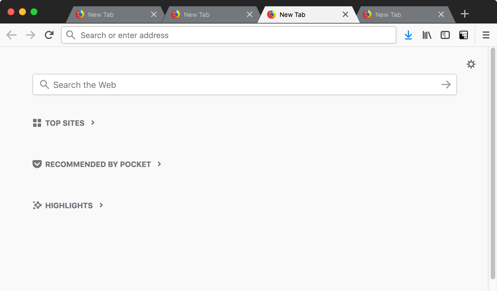

# firefox-like-chrome
This is the userChrome.css that can be used to theme Firfox Quantum 59.0 or later versions to look like chrome

<h6 align='center'>Tab Bar</h6>

Please refer to [UserChrome.css](http://kb.mozillazine.org/index.php?title=UserChrome.css&printable=yes) to know more about how can you use this.

In an nutshell
- Type about:profiles in your address bar.
- Open the "Root Directory" folder.
- Open or create a folder called "chrome" in the Root Directory. You might already have that folder with the userChrome.css there. You may want to back up this file. Just rename it to userChrome-BAK.css
- Copy my userChrome.css to this folder.
- Restart Firefox

The tabs are too close to the top edge of the window and therefore ditficult to drag, so you can add a little drag area using the following steps.
###### Recommended Setting to make the Firefox UI look like above

