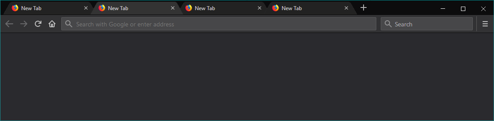

This userChrome file changes the tabs in Firefox to look similar to the second iteration of Chrome's tabs (trapezoid style). It is designed to match Firefox's default dark mode theme.

## Preface

To allow custom themes (`userChrome.css` and `userContent.css`) in FireFox 69+ go to `about:config` in a new tab and turn on the `toolkit.legacyUserProfileCustomizations.stylesheets` setting.

* * *

The location for your userChrome file will be something like this:

* `C:\Users\<YOUR NAME>\AppData\Roaming\Mozilla\Firefox\Profiles\<PROFILE ID>.default\chrome\userChrome.css`

You may need to create the `chrome` folder and `userChrome.css` file yourself. If one already exists, you should rename it to `userChrome.css.BAK` as a backup.

* * *

Screenshot on Windows 10 with Firefox Quantum 64:

